# Machine Learning (MATLAB)

Machine Learning course from Stanford University on Coursera.

### Environment
- macOS Catalina (version 10.15.3)
- MATLAB 2018 b

### Dataset
- ex2data1.txt (one feature)
- ex2data2.txt (two features)

### Files included in this repo
- ex2.m - Octave/MATLAB script that steps you through the exercise
- ex2 reg.m - Octave/MATLAB script for the later parts of the exercise
- ex2data1.txt - Training set for the first half of the exercise
- ex2data2.txt - Training set for the second half of the exercise
- submit.m - Submission script that sends your solutions to our servers
- mapFeature.m - Function to generate polynomial features
- plotDecisionBoundary.m - Function to plot classifier’s decision boundary

[⋆] plotData.m - Function to plot 2D classification data

[⋆] sigmoid.m - Sigmoid Function

[⋆] costFunction.m - Logistic Regression Cost Function

[⋆] predict.m - Logistic Regression Prediction Function

[⋆] costFunctionReg.m - Regularized Logistic Regression Cost


## Part 1: Logistic Regression

In this part, we will build a logistic regression model to predict whether a student gets admitted into a university.

Suppose that you are the administrator of a university department and you want to determine each applicant’s chance of admission based on their results on two exams. You have historical data from previous applicants that you can use as a training set for logistic regression. For each training example, you have the applicant’s scores on two exams and the admissions decision.

Our task is to build a classification model that estimates an applicant’s probability of admission based the scores from those two exams.

For this portion we will use following script
```
ex2.m
```

### Part 1.1: Visualizing the data
### plotData.m : Function to plot classifier’s decision boundary

```
function plotData(X, y)

% Create New Figure
figure; hold on;

% Plot the positive and negative examples on a 2D plot, using the option 'k+' for the positive 
% examples and 'ko' for the negative examples.

% Find Indices of Positive and Negative Examples
pos = find(y == 1);
neg = find(y == 0);

% Plot Examples
plot(X(pos, 1), X(pos, 2), 'k+', 'LineWidth', 2,'MarkerSize', 7);
plot(X(neg, 1), X(neg, 2), 'ko', 'MarkerFaceColor', 'y','MarkerSize', 7);

hold off;
end
```

plotData.m is used to generate a figure where the axes are the two exam scores, and the positive and negative examples are shown with different markers.

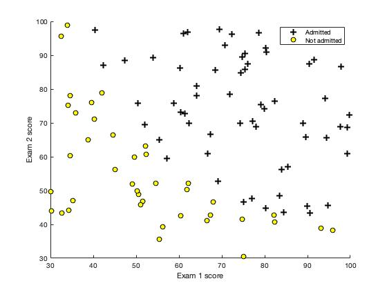
- Figure: Scatterplot of training data


### Part 1.2: Implementation 

The Logistic Regression Hypothesis:

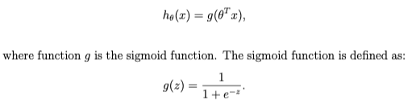

### sigmoid.m - Sigmoid Function
Implement following function in sigmoid.m.
For large positive values of x, the sigmoid should be close to 1, while for large negative values, the sigmoid should be close to 0.

```
function g = sigmoid(z)

g = zeros(size(z));

# Compute the sigmoid of each value of z (z can be a matrix, vector or scalar).

g = 1 ./ (1 + exp(-z))

end
```

### costFunction.m - Logistic Regression Cost Function
Implement the cost function and gradient for logistic regression.

- Cost Function in logistic regression:

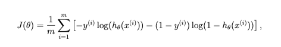

- Gradient of the cost

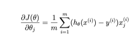

The code in costFunction.m to return the cost and gradient.

```
function [J, grad] = costFunction(theta, X, y)

% Initialize some useful values
m = length(y); % number of training examples

% Compute the cost of a particular choice of theta.
%               You should set J to the cost.
%               Compute the partial derivatives and set grad to the partial
%               derivatives of the cost w.r.t. each parameter in theta
%
% Note: grad should have the same dimensions as theta

h = sigmoid(X * theta);
J = (1/m) .* sum(-y .* log(h)-(1-y) .* log(1-h));
grad = 1/m * X' * (h - y);

end
```

### Learning parameters using fminuc
Octave/MATLAB’s fminunc is an optimization solver that finds the minimum of an unconstrained function. For logistic regression, you want to optimize the cost function J(θ) with parameters θ.

NOTE:: Install MATLAB - Optimization Toolbox

We are going to use fminunc to find the best parameters θ for the logistic regression cost function, given a fixed dataset (of X and y values).

We will pass to fminunc the following inputs:
- The initial values of the parameters we are trying to optimize.
- A function that, when given the training set and a particular θ, computes the logistic regression cost and gradient with respect to θ for the dataset (X, y)

```
# a built-in function (fminunc) to find the optimal parameters theta.

# Set options for fminunc
options = optimset('GradObj', 'on', 'MaxIter', 400);

# Run fminunc to obtain the optimal theta
# This function will return theta and the cost 

[theta, cost] = ...
	fminunc(@(t)(costFunction(t, X, y)), initial_theta, options);
```

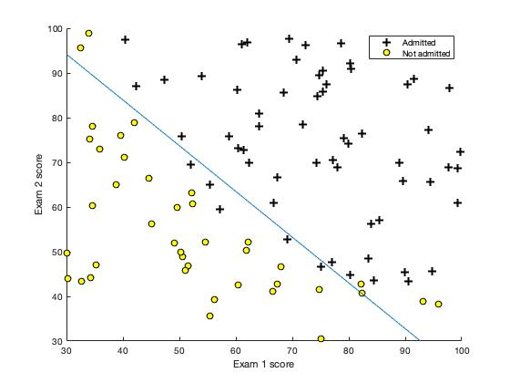
- Figure: Training data with decision boundry


### Evaluating logistic regression
### predict.m - Logistic Regression Prediction Function

We can use the model to predict whether a particular student will be admitted. For a student with an Exam 1 score of 45 and an Exam 2 score of 85, we should expect to see an admission probability of *0.776*.

```
function p = predict(theta, X)

% Instructions: Complete the following code to make predictions using
%               your learned logistic regression parameters. 
%               You should set p to a vector of 0's and 1's
%

h = sigmoid(X * theta);
p = round(h);

end
```

## Part 2: Regularized Logistic Regression

In this part, we will implement regularized logistic regression to predict whether microchips from a fabrication plant passes quality assurance (QA). During QA, each microchip goes through various tests to ensure it is functioning correctly.

Suppose you are the product manager of the factory and you have the test results for some microchips on two different tests. From these two tests, you would like to determine whether the microchips should be accepted or rejected. To help make the decision, we have a dataset of test results on past microchips, from which we can build a logistic regression model.

For this portion we will use following script
```
ex2_reg.m
```

### Part 2.1: Visualizing the data
### plotDecisionBoundary.m - Function to plot classifier’s decision boundary

plotDecisionBoundary.m is used to generate a figure where the axes are the two exam scores, and the positive (y = 1, accepted) and negative (y = 0, rejected) examples are shown with different markers.

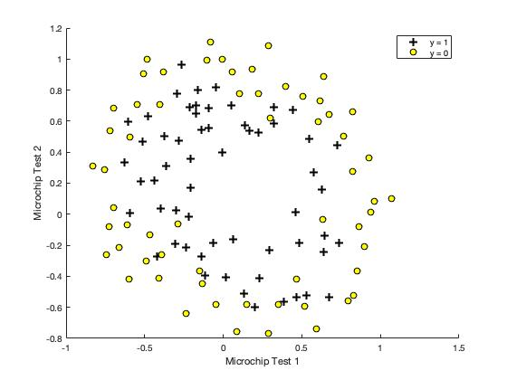
- Figure: Scatterplot of training data

Figure shows that our dataset cannot be separated into positive and negative examples by a straight-line through the plot. Therefore, a straight-forward application of logistic regression will not perform well on this dataset since logistic regression will only be able to find a linear decision boundary.

```
function plotDecisionBoundary(theta, X, y)

%   PLOTDECISIONBOUNDARY(theta, X,y) plots the data points with + for the 
%   positive examples and o for the negative examples. X is assumed to be 
%   a either 
%   1) Mx3 matrix, where the first column is an all-ones column for the 
%      intercept.
%   2) MxN, N>3 matrix, where the first column is all-ones

% Plot Data
plotData(X(:,2:3), y);
hold on

if size(X, 2) <= 3
    % Only need 2 points to define a line, so choose two endpoints
    plot_x = [min(X(:,2))-2,  max(X(:,2))+2];

    % Calculate the decision boundary line
    plot_y = (-1./theta(3)).*(theta(2).*plot_x + theta(1));

    % Plot, and adjust axes for better viewing
    plot(plot_x, plot_y)
    
    % Legend, specific for the exercise
    legend('Admitted', 'Not admitted', 'Decision Boundary')
    axis([30, 100, 30, 100])
else
    % Here is the grid range
    u = linspace(-1, 1.5, 50);
    v = linspace(-1, 1.5, 50);

    z = zeros(length(u), length(v));
    % Evaluate z = theta*x over the grid
    for i = 1:length(u)
        for j = 1:length(v)
            z(i,j) = mapFeature(u(i), v(j))*theta;
        end
    end
    z = z'; % important to transpose z before calling contour

    % Plot z = 0
    % Notice you need to specify the range [0, 0]
    contour(u, v, z, [0, 0], 'LineWidth', 2)
end
hold off
end
```

### Part 2.2: Feature mapping
### mapFeature.m - Function to generate polynomial features 
One way to fit the data better is to create more features from each data point.
In the provided function mapFeature.m, we will map the features into all polynomial terms of x1 and x2 up to the sixth power.

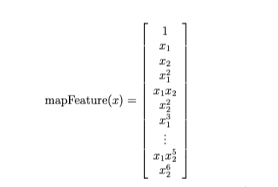

As a result of this mapping, our vector of two features (the scores on two QA tests) has been transformed into a 28-dimensional vector. A logistic regression classifier trained on this higher-dimension feature vector will have a more complex decision boundary and will appear nonlinear when drawn in our 2-dimensional plot.
While the feature mapping allows us to build a more expressive classifier, it also more susceptible to overfitting.

```
function out = mapFeature(X1, X2)

degree = 6;
out = ones(size(X1(:,1)));
for i = 1:degree
    for j = 0:i
        out(:, end+1) = (X1.^(i-j)).*(X2.^j);
    end
end
end
```

In the next parts, we will implement regularized logistic regression to fit the data and also see how regularization can help combat the overfitting problem.

### Part 2.3: Cost Function and gradient
### costFunctionReg.m - Regularized Logistic Regression Cost

Implement the cost function and gradient for regularized logistic regression.

- Regularized Cost Function in logistic regression:

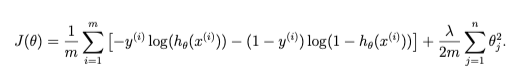

In Octave/MALLAB, recall that indexing starts from 1, hence, we should not be regularizing the theta(1) parameter (which corresponds to *0_0*) in the code. The gradient of the cost function is a vector where the jth element is defined as follows:

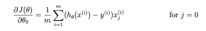

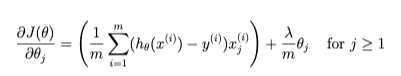

The code in costFunction.m to return the cost and gradient.

```
function [J, grad] = costFunctionReg(theta, X, y, lambda)

% Initialize some useful values
m = length(y); % number of training examples

% Instructions: Compute the cost of a particular choice of theta.
%               You should set J to the cost.
%               Compute the partial derivatives and set grad to the partial
%               derivatives of the cost w.r.t. each parameter in theta

h = sigmoid(X * theta);
J = (1/m) * sum(-y .* log(h)-(1-y) .* log(1-h)) + (lambda/(2 * m)) * sum(theta(2:end).^2);
grad = (1/m * X' * (h - y)) + [0;(lambda/m) * theta(2:end)];

end
```

ex2_reg.m will call costFunctionReg function using initial value of θ (initialized to all zeros). We should see that the cost is about *0.693*.

### Learning parameters using fminuc

Similar to the first part, we will use fminunc to learn the optimal parameters θ.
```
# Initialize fitting parameters
initial_theta = zeros(size(X, 2), 1);

# Set regularization parameter lambda to 1 (you should vary this)
lambda = 1;

# Set Options
options = optimset('GradObj', 'on', 'MaxIter', 400);

# Optimize
[theta, J, exit_flag] = ...
	fminunc(@(t)(costFunctionReg(t, X, y, lambda)), initial_theta, options);
```

### Part 2.4: Plotting the decision boundary
### plotDecisionBoundary.m - Function to plot classifier’s decision boundary
The function plotDecisionBoundary.m which plots the (non-linear) decision boundary that separates the positive and negative examples.

In plotDecisionBoundary.m, we plot the non-linear decision boundary by computing the classifier’s predictions on an evenly spaced grid and then and drew a contour plot of where the predictions change from y = 0 to y = 1.

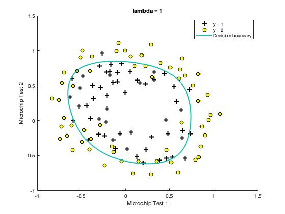
- Figure: Training data with decision boundary (λ = 1)


## Result

### Logistic Regression: Train Accuracy: 89.0


- Figure: Training data with decision boundry

### Regularized Logistic Regression: Train Accuracy (with lambda = 1): 83.1


- Figure: Training data with decision boundary (λ = 1)

### OPTIONAL
### Part 2.5: Optimizing different regularization parameters
In this part, we will get to try out different regularization parameters for the dataset to understand how regularization prevents over-fitting.

Notice the changes in the decision boundary as you vary λ. With a small λ, we should find that the classifier gets almost every training example correct, but draws a very complicated boundary, thus overfitting the data.

### Regularized Logistic Regression: Train Accuracy (with lambda = 0): 88.98

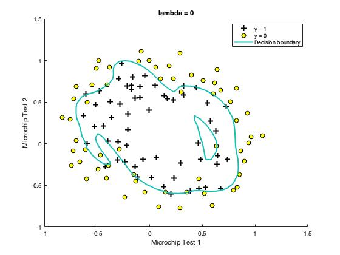
- Figure: No regularization (Overfitting) (λ = 0)

This is not a good decision boundary: for example, it predicts that a point at x = (−0.25, 1.5) is accepted (y = 1), which seems to be an incorrect decision given the training set.

With a larger λ, we should see a plot that shows an simpler decision boundary which still separates the positives and negatives fairly well. However, if λ is set to too high a value, we will not get a good fit and the decision boundary will not follow the data so well, thus underfitting the data.

### Regularized Logistic Regression: Train Accuracy (with lambda = 100): 61.02

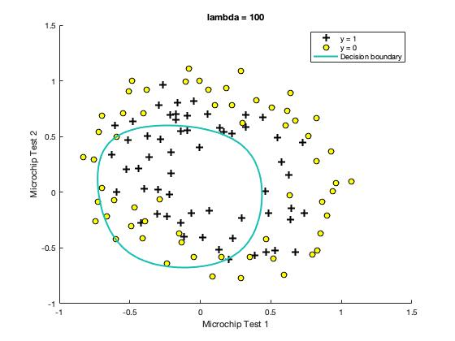
- Figure: Too much regularization (Underfitting) (λ = 100)


## Course Links

1) Machine Learning by Stanford University on [Coursera](https://www.coursera.org/learn/machine-learning)

2) [Linear Regression](https://www.coursera.org/learn/machine-learning/programming/8f3qT/linear-regression) 
(Please notice that you need to log in to see the programming assignment.)